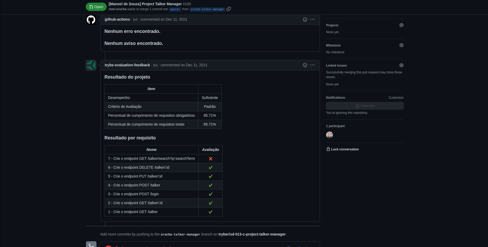

# Project Talker Manager

### The Assignment

You will develop an API from a CRUD (**C**reate, **R**ead, **U**pdate and **D**elete) of speakers. You will develop some endpoints that will read and write to a file, using the `fs` module.

### Skills to be Tested

In this project, I was able to:

- Perform asynchronous operations using callbacks;
- Perform asynchronous operations using Promises;
- Read and write files locally with NodeJS;
- Write your own scripts that create and consume Promises;
- Rewrite code that uses callbacks to use Promises;
- Make function calls consciously;
- Understand the basics of how JavaScript works;
- Detect and solve problems in the code more objectively;
- Understand the difference between synchronous and asynchronous execution;
- Understand what HTTP is, what an API is and what the two have to do with Express;
- Write APIs using Node and Express;
- Understand the structure of an Express application and how to organize its code;
- Create routes and apply middlewares.

### Evaluator Results

### Disclaimer

This assignment was developed by [Trybe](https://www.betrybe.com) in order to test my skills with Node.js and Express.js, and creating CRUD APIs.
